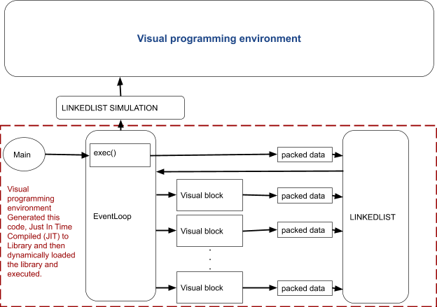

.. index::

*****************************************
Target program generation and simulation
*****************************************

In the previous section, we saw an overview of how the generated program works. In this section, we will see the connection between visual programming environment, simulation and the generated program. 

Initially, the user design the program by placing the blocks, connecting them and by editing the configuration and expressions. When he finishes the design and click the run button, few things happens.  First a connection tree is made from the design, where the blocks are tree nodes with main block is the root of the tree. This connection tree has all the information about the connections between the blocks. Next, the code for each block is generated. 

   Figure 1.4: Block diagram representation of connection between the visual programming environment and the generated library.    The environment first desugar the expressions to C code and then generate the codes for each block. They are then compiled      in just in time to a library. This library then dynamically loaded and executed. Each block data are copied into a second      linked list for shown in the visual programming environment.  
   
Code generation
===============

In code generation face, the C code for each block is generated. These blocks are functions.
The expressions on the blocks are tokenized and parsed and then compiled to the C code (desugared). More on this in later sections. A make file necessary for the compilation also generated. 

Just in Time Compilation (JIT) of library
=========================================

Just in time compilation is the compilation of program during the run time. In this case also we have the same situation. The codes generated from previous section is compiled into a library. THis is the same library which will be used in the visual programming environment, or on a stand alone application.

Dynamic loading of library
===========================

The next important feature used is the dynamic loading of library. The library compiled in the previous section is loaded by the environment and executed. It is called dynamic loading because the library is loaded at a time after the startup of the program. 

Data sharing from library to the visual environment
===================================================

All blocks output data are copied into a second linked list (queue) by the event loop in the library, when the library called from the visual environment (in the case of stand alone execution of library), no data is copied into the second linked list. The visual environment has access to this linked list and it access the data in a FIFO manner. All these data are printed or plotted on corresponding block outputs in the visual environment. In this way, the visual debugging is simplified and user can easily verify each block output. Even the user can simulate the program flow in a step by step manner, since the data is still available in the linked list for simulation. 

One important advantage is that the same library is used for the visual simulation and also for the stand alone application. This will ensure the same working.

Concurrent programming 
======================

Every block function are run in a thread, thus we can say it is a concurrent programming.

Distributed programming
=======================

The visual programming supports also distributed programming, which means run some blocks on one computer and other blocks on a different computer. The program communicates with ip address and port number. There are two blocks facilitates this functionality, network server block and network client block. They can be used to send data over network or for a remote procedure call (RPC).
   
