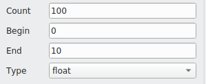
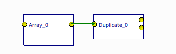
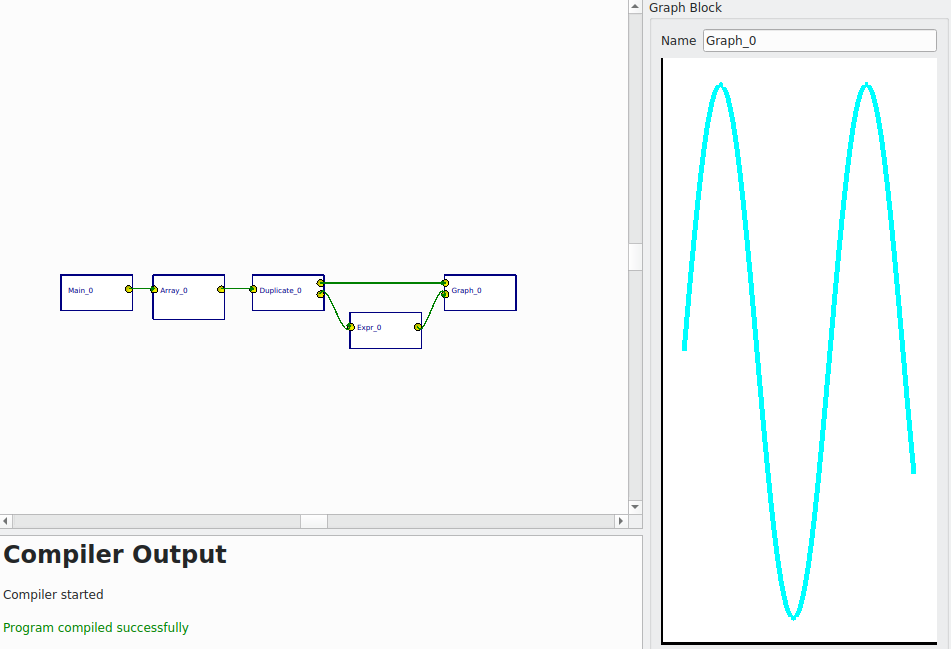
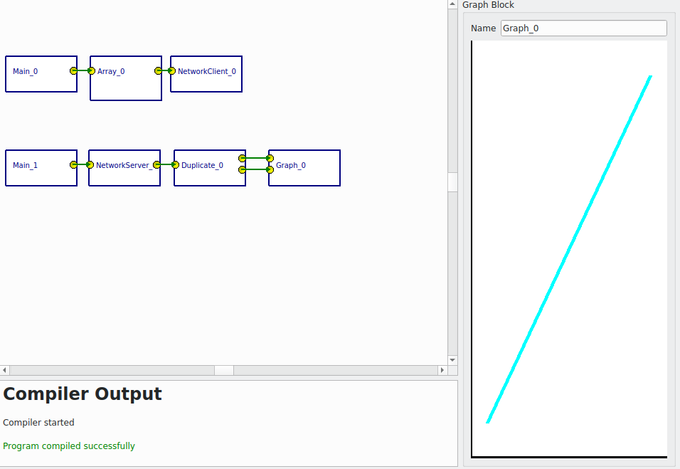

.. index::

*******************************
Visual programming environment
*******************************

In the previous sections, we were showing the visual programming environment as a single block, but there are many things going on in this block. In this section we will analyse the block in details.

Visual blocks
==============

The idea of blocks for programming is coming from our nature of explaining or comprehending ideas by writing boards. This is how we explain the things to another person, our creating our ideas more clear. In this way, we will be concentrating on what to do rather than how to do.
There are many blocks available, let’s go through them now.

Main block
-----------

We already saw main block in previous sections. Main block is the entry block in the program as the main function in the C. 

Array block
------------

Array block is used to generate arrays. There are different ways to generate arrays. One is the classical programming way, where we give the total number of array elements, beginning (included), upper limit (excluded) and the type as shown in Figure 3.1.

   Figure 3.1: Array definition.
   
Another way to generate the array is by the set notation (known as set comprehension or list comprehension). One can define it as,
x <- [0,1 .. 99] 

Duplicate block
---------------

This block duplicates the data into two. For example, if we have one data connection from the array block, we can duplicate the data and have two similar data outputs from duplicate block.

   Figure 3.2: Data duplicate block with array block.
   
Expression block
-----------------

In expression block, one can define expressions which will act on the input data. For example if one wants the sin(x) function acting on the input, just write the sin(x) function in the expression input. The output will be a sin(x).
One can also give some functions as an expression, for example the factorial function.

Graph block: A graph block plot the data coming to the input. In Figure 3.3, one can see the graph block connected to other blocks draw a sine function.

   Figure 3.3: A graph block connected to the other blocks plotted a sine function
   
Network server block
--------------------

A network server block is used for the distributed programming. One can call a remote procedure connected with the server block. Thus it can be also called RPC. The block receive data through a port and ip address from a Network client block. In Figure 3.4, a network server block connected to another blocks is shown.
   
.. figure:: images/image3.png

   Figure 3.4: A network server block in action. It receives data sent from network client 
   block and plot it. 

Network client block
--------------------

A network client block is used to send data over network and it can be considered as the RPC in distributed computing.  

.. figure:: images/image6.png

   Figure 3.5: A network client block send an array data over ip to specific port.

In Figure 3.6, shown both network server and client blocks are in action. The client block send data to the server block and the server block plot the data.

   Figure 3.6: A network client block and network server block in action.

State Machine block
--------------------

Simulation1D block
------------------

The idea of simulation1D block is to simulated the nature of data in 1D. For example, if we give a sine wave input, sphere will oscillate. a simulation1D block is a block with one sphere and two inputs to it. One input is the time and another input is the position. The position can be assigned either in x - axis or y-axis or z-axis.  

.. figure:: images/sine_sim_30fps.gif

   Gif 3.1: An animated program and data flow to show the simulation block. The Main block is the entry block, which calls an    Array block. The Array block creates an array data and this data is sent to the Duplicate block. The Duplicate block          duplicates the data and the output is two identical arrays. One is fed through an Expression block, in this case a sin(x)    expression. Finally data are simulated in a Simulation1D block. 

GSLOdeSolver block
------------------

